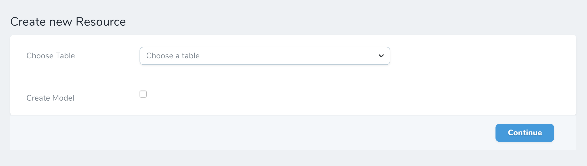
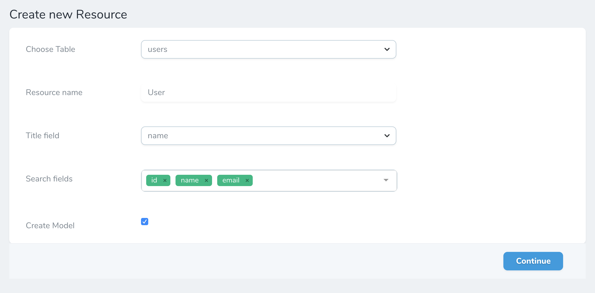

# The Tool

After installation you will see a new sidebar link: `Generator`. Click in this link and you'll be redirect to our tool 8-):

After table selection you will need to edit:

* **Resource name**: Automatic handled by the Generator but editable
* **Title Field**: Title variable for Nova search
* **Search Field**: Search columns to be indexed by Nova search
* **Create Model**: If you want to generate also the Model file

After press Continue you will be see the field editor.