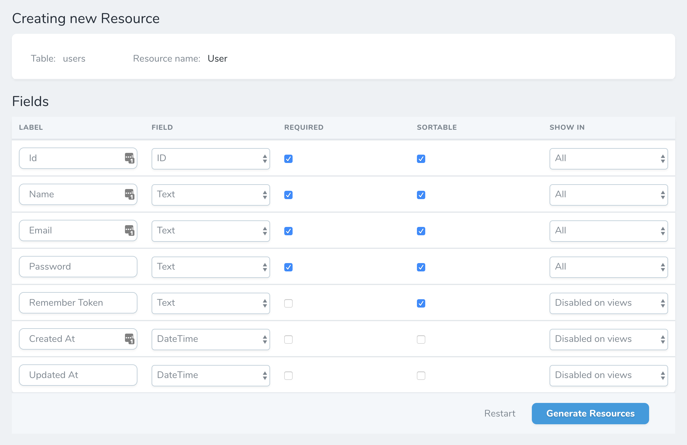
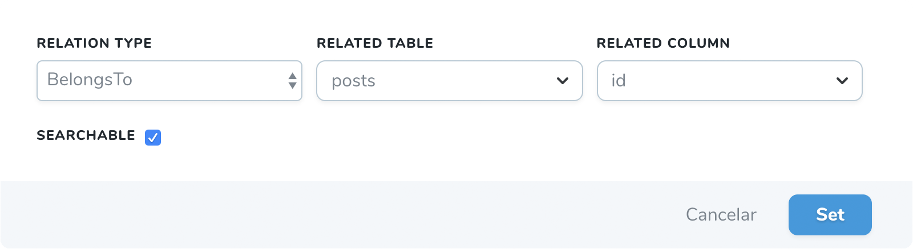
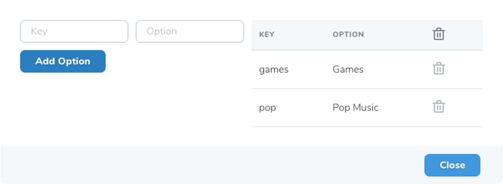

# Fields

After choose the general options for your new Resource a table with all columns will be shown.

## Label

Set the label of your field. By default a Title case of your column.

## Field

By default the tool will set the next Nova fields based on column type:

Column | Nova Field
------------ | -------------
Clumn name is `id` | ID
Column name contains `_id`| Relation*
Column type is `Integer` | Number
Column type is `Date` | Date
Column type is `Datetime` | DateTime
Rest of fields | Text

Relations:

There are 4 relations covered by our tool (next relationships wil be added in the future).

* HasOne
* HasMany
* BelongsTo - Searchable option
* BelongsToMany

You will be able to choose the relation table and the field

## Required

If you wan to set this field as required. By default checkbox is unchecked if the DB column is nullable.

If you set false in settings page all checkboxes will be unchecked. 

::: tip Info
`deleted_at`, `created_at`, `updated_at` columns are not required by default.
:::

## Sortable

If you want to set this field as sortable in the index view. By default all columns ar sortable.

If you set false in settings page all checkboxes will be unchecked. 

::: tip Info
`deleted_at`, `created_at`, `updated_at` columns are not sortable by default.
:::

## Show in

As in Laravel Nova, you can customize when you want to display a field.

You have the all options from nova:

* `hideFromIndex`
* `hideFromDetail`
* `hideWhenCreating`
* `hideWhenUpdating`
* `onlyOnIndex`
* `onlyOnDetail`
* `onlyOnForms`
* `exceptOnForms`

::: tip Info
`All` option will show the field in all views.

`Disabled` option will remove this field from the resource.

`deleted_at`, `created_at`, `updated_at` columns are disabled by default.
:::

## Extras

Some field types has extra options. When a field has an extra a new column will appear with a button to set the extras. Each extra field has differents options.

* [Boolean](#boolean)
* [Code](#code)
* [Currency](#currenct)
* [Date and Datetime](#dateanddatetime)
* [File, Image and file-image-and-avatar](#file-image-and-avatar)
* [Number](#number)
* [Place](#place)
* [Trix](#trix)
* [Status](#status)
* [Select](#select)

### Boolean

Two inputs to set a `True Value` and a `False value`.

### Code

A select will be shown to select the `language` or if is a `json`.

### Currency

An input to set the `format` will be shown on the modal.

### Date and Datetime

An input to set the `format` will be shown on the modal.

### File, Image and Avatar

An input to set the `disk` will be shown on the modal. Also a checkbox with `prunable`.

### Number

Three inputs will be shown. `Min`, `Max` and `step`.

### Place

A multiselect will be appear to set the `countries`. Also a checkbox to limit to cities.

### Trix

An input to set the `disk` will be shown on the modal. 

### Status

Two options to set `loadingWhen` and `failedWhen`.

### Select
	
When you choose a `Select` Field, an extra button will appear. Click on that button to open a modal to set the `key => option` to create an array.

